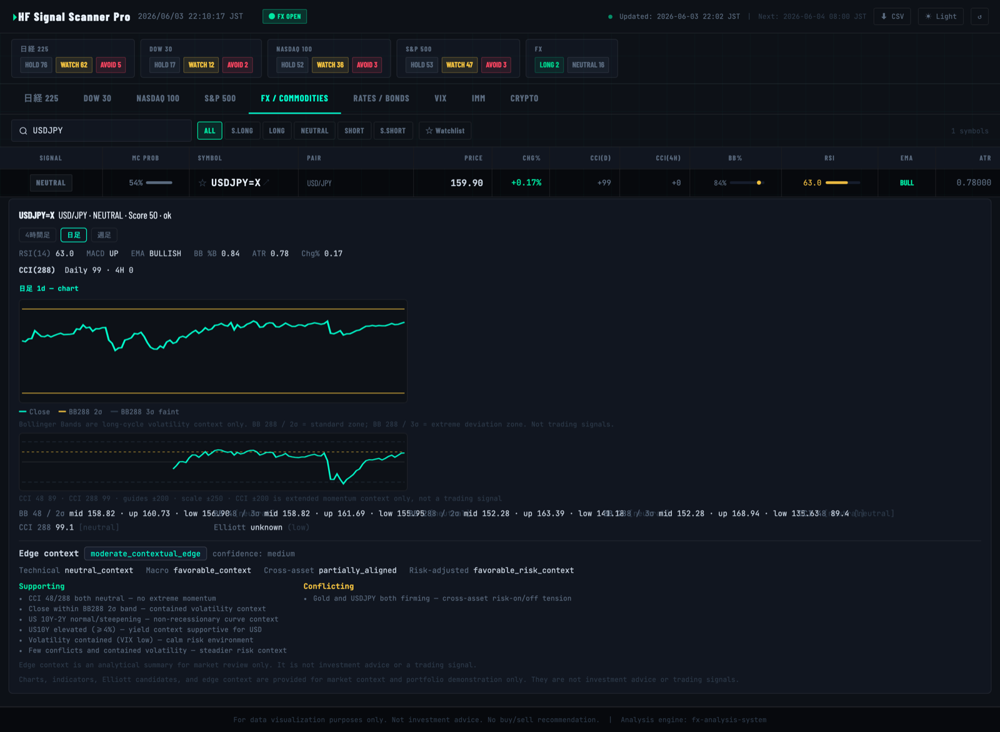
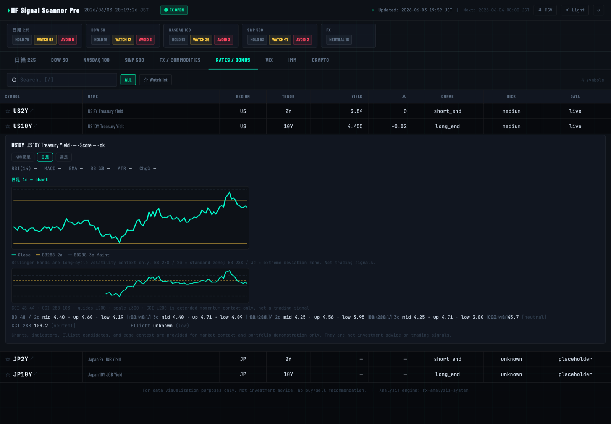
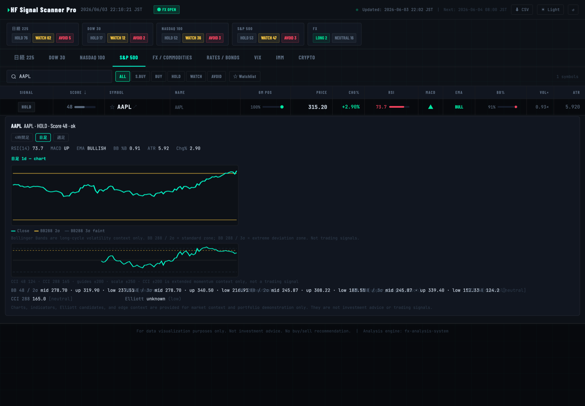
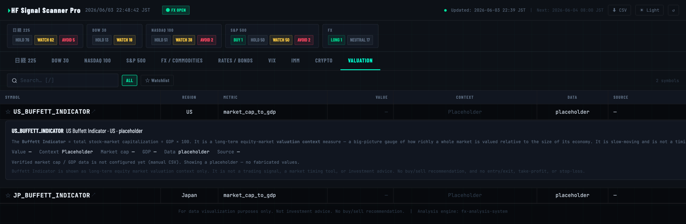

# HF Signal Scanner Pro

A public, auto-updating **cross-asset market dashboard** — equities, FX, commodities, rates,
volatility, IMM positioning, and crypto — with per-symbol technical charts (Bollinger Bands,
CCI) and an investment-bank-style macro layer (yield curve, regime context).

**▶ Live dashboard: https://hf-signal-dashboard.pages.dev/**

> **30-second pitch:** A Python pipeline pulls daily market data from Yahoo Finance, scores it
> across 9 market groups, and writes a single `data.json`. A dependency-free static front-end
> (inline-SVG charts, no chart library) renders it, deployed on Cloudflare Pages and refreshed
> automatically every day by GitHub Actions. It demonstrates an end-to-end data pipeline,
> CI-driven data refresh, a documented data contract between a public UI and a private analysis
> engine, and careful GRC framing (everything is market *context*, never trade advice).

> **For data visualization and portfolio demonstration only. Not investment advice. No buy/sell recommendation.**

---

## What it is

A two-component market-analysis stack:

| Component | Role |
|---|---|
| **hf-signal-dashboard** (this repo) | Public UI + its own data pipeline. Renders the dashboard. |
| **fx-analysis-system** *(private engine)* | Deeper macro risk scoring / COT / event-risk analysis. Kept private. |

The dashboard is **self-contained**: the data format, sample data, and signal logic needed to
understand the project all live in this public repo. The integration interface to the private
engine is documented in [DATA_CONTRACT.md](DATA_CONTRACT.md) — so the engine can stay private
without leaving the portfolio incomplete.

---

## Features (v4.4 / Phase 1.6 — instant notify + tamper-evident log)

- **Two-route instant notify (v4.4 / Phase 1.6).** ENTRY/EXIT判定の瞬間に Mac mini
  ローカル通知 (osascript) と ntfy.sh 経由スマホ通知の **二経路** で発火。両ルートとも
  完全 keyless (Gmail OAuth / API key 不要)。ntfy のトピック文字列だけは推測困難な
  乱数値を `config.local` に置く方針で公開リポには出さない。両ルート同時失敗時は
  `data/local/notify_queue.jsonl` に積み、次サイクルで自動再送 (queue + retry)。
  `event_id` 単位の 24 時間 dedup で同一判定の二重送信を抑止。
- **Append-only ハッシュチェーン台帳 (改竄不能ログ).** `notify/chain.py` は
  `data/local/notifications.jsonl` に 1 行 1 イベントで書き込み、`prev_hash + payload
  → sha256 → curr_hash` の連鎖で後出し改竄を物理封鎖。pytest は (a) 中間行の改竄、
  (b) 中間行の削除、(c) 偽行の挿入、を全て chain.verify() が検知することを保証。
  EXIT_TP/SL/TIMEOUT は `entry_ref` に対応する過去 ENTRY を必ず参照しなければ
  `ValueError` で拒否され、「片方隠し」のインチキを構造で封じる。
- **look-ahead 厳禁の ENTRY/EXIT 判定.** `notify/triggers.evaluate(bars, t_index, ...)`
  は `bars[:t_index+1]` のみ参照。テストは `bars` を監視 list に置き換え、関数が
  `t_index` を超えるインデックスにアクセスした瞬間に失敗する。仕様の本質を
  「読まない」ことそのもので守る。
- **launchd 常駐 receiver.** `scripts/notify_receiver.py` を `KeepAlive` で 60 秒
  ループ。死んだら macOS が即再起動。Mac mini 落下時も ntfy 経路でスマホには届く。
  ロード手順:

  ```sh
  mkdir -p ~/Library/LaunchAgents
  sed "s/USER/$USER/g" scripts/com.hf.notify.plist > ~/Library/LaunchAgents/com.hf.notify.plist
  launchctl unload ~/Library/LaunchAgents/com.hf.notify.plist 2>/dev/null || true
  launchctl load -w ~/Library/LaunchAgents/com.hf.notify.plist
  launchctl list | grep com.hf.notify     # 動作確認
  ```
- **SURVIVAL 内通知ログパネル.** `docs/assets/survival/notify_panel.js` がブラウザ側で
  もう一度ハッシュチェーンを再計算し、断裂時は赤バナー「⚠ chain integrity failed at
  index N」を最上部に出す。価格は公開抜粋から除外 (`export_public`)、判定の事実だけを公開。
- **GRC.** すべての通知本文に「事実記録 / not investment advice」を必ず含む
  (テストで保証)。執行助言ではなく「自分が立てた判定を自分に通知する」位置づけ。
  `config.local` / `data/local/` は `.gitignore` 済 — 個別損益はリポに出ない。

## Features (v4.3 / Phase 1.5 — weekend autocollect)

- **Weekend autocollect (v4.3 / Phase 1.5)** — a separate workflow
  `.github/workflows/collect.yml` fires four extra cron runs without human
  intervention: `0 15 * * 4,5,6` (Thu–Sat UTC = Fri–Sun 0:00 JST) and
  `0 18 * * 0` (Sun UTC = Mon 03:00 JST). Each run invokes `collector.cli`
  which calls `fetch_signals.main()`, writes an abridged daily snapshot to
  `data/history/YYYY-MM-DD.json` (idempotent: same-day re-runs normalize),
  updates `data/history/index.jsonl`, and appends a structured row to
  `data/collect_log.jsonl` (per-source ok/failed/ratelimited + first 5 errors).
  All sources stay keyless; `collector.runtime` ships a polite User-Agent,
  per-host rate floor (≥ 0.4 s), and exponential-backoff retry. A single
  source failure is recorded but never breaks the run. Learning (Phase 2) and
  win/loss adjudication (Phase 3) are deliberately not implemented — only the
  recording boxes are wired so that samples accumulate over the weekend.

## Features (v4.2 / Phase 1)

- **9 tabs (SURVIVAL default)** — **SURVIVAL** (生存ループ / 3-second judgment), Nikkei 225,
  Dow 30, Nasdaq 100, S&P 500, FX / 商品,
  **金利・債券・VOL** (rates_vol; US/JP 2Y/10Y/30Y + VIX + MOVE in one view),
  **ポジション/割安度** (pos_val; CFTC IMM + Crypto + Buffett Indicator sectioned),
  **お金の流れ** (moneyflow; 3-region: US/EU/JP).
- **SURVIVAL tab (v4.2 / Phase 1)** — 1-word risk gate (`risk-on / neutral / risk-off`,
  computed from money_flow + VIX + yield_curve), auto-designed daily risk (inverse-vol scaling
  × 1/4 Kelly, capped at 0.5%/trade by `survival.risk_engine.HARD_CAPS`), `edge_score` candidate
  list with one-tap Mode B logging (localStorage only), pattern-based exit table (only the
  take-profit cell auto-adjusts daily; stop-loss / DD / margin-call ceilings are **fixed**),
  Monte-Carlo bankruptcy heatmap with closed-form Kaufman comparison, and client-side
  hit-rate / ROI / Brier / pattern win-rate aggregation. **Zero human input. No learning.**
  P&L / balances never leave the browser; `config.local*` is in `.gitignore`.
- **お金の流れ panel (v4.1)** — keyless 3-region (US / Eurozone / Japan) flow visualization with
  central-bank → assets particle animation, debt counters, and freshness badges. US shows
  WALCL / TGA / RRP / net_liquidity / debt_to_penny (daily delta); EU shows ECBASSETSW with a
  weekly badge; JP shows JPNASSETS monthly. Failed series degrade to `placeholder` (no fabrication).
- **Background animation layer** — full-viewport `<canvas id="bg-fx">` with three modes
  (`clean`, `starfield`, `constellation`). Always behind data UI, `pointer-events:none`,
  `aria-hidden`, 30fps cap, respects `prefers-reduced-motion`, pauses on tab hide, and halves
  particle count on mobile. Mode persisted in `localStorage.hf_bg_mode`. Default = `clean`.
- **Minimal i18n (JA / EN)** — toggle in the header re-labels tabs / region headers / disclaimers.
  Persisted in `localStorage.hf_lang`.
- **Legacy 10-tab layout** — superseded; the underlying `markets.{rates,volatility,imm,crypto,valuation}`
  arrays remain in `data.json` for downstream consumers.
- **Click-to-expand detail panel** per symbol with lightweight **inline-SVG charts** (no external
  chart library, mobile-friendly), with **switchable 4h / 1d / 1w timeframe tabs** (4h/1w on an
  allowlist of liquid symbols — USDJPY, EURUSD, XAUUSD, XAGUSD, VIX, BTC, ETH, US2Y, US10Y):
  - Close / yield line
  - **Bollinger Bands 288** (2σ and 3σ) overlay — long-cycle volatility context
  - **CCI 48 / 288** lower panel with ±200 reference — extended momentum context
  - Heuristic **Elliott** candidate (badge/note only, `confidence: low`)
- **Live yields & yield curve** — US2Y / US10Y fetched and normalized from Yahoo; **US and Japan
  curves are assessed separately** (US recession-inversion logic is never applied to JGB);
  US-JP 10Y spread as USDJPY context. Japan (JP2Y/JP10Y) is **auto-ingested from the official Japan
  Ministry of Finance JGB historical CSV** (`data_status: auto_mof`, no API key) with a yield chart;
  on failure it falls back to a **user-verified** `data/jp_rates.csv` (`manual_csv`; see
  `docs/sample-jp-rates.csv`) then an explicit placeholder rather than unverified data. When JP yields
  are present, the Japan curve and US-JP spread compute and the USDJPY edge picks up the spread.
- **Cross-asset macro layer** (data contract) — rates, volatility (VIX/MOVE), commodities incl.
  Gold/Silver & Copper/Gold ratios, regime labels, and an `edge_context` analytical summary.
- **Valuation (v4.x) — Buffett Indicator** — long-term equity-market valuation context
  (market cap ÷ GDP × 100). **US** ships a verified series (301 quarters, 1947→present) computed from
  two official **keyless** FRED downloads (`NCBEILQ027S` Z.1 corporate equities ÷ nominal `GDP`),
  committed to `data/valuation_metrics.csv` (`data_status: manual_csv`, `source` shows FRED) and
  rendered as a long-term valuation chart (BB288/CCI computed over the long history). **Japan** stays
  an explicit placeholder (no current keyless, definition-aligned source — no fabrication). Shown as a
  long-term valuation regime / context only — **not market timing**, not a trading signal.
- **Watchlist, search, signal filters, CSV export, dark/light theme** in the UI.
- **Graceful degradation** — symbols without chart data, errored tickers, and placeholder rows
  all fall back cleanly; the daily pipeline never fails on a single bad ticker.

Markets/symbols without computed charts (e.g. equities, IMM, Japan rates) show a clear
"chart data not available" fallback — no fabricated values.

---

## Supported markets

| Tab | Coverage | Detail charts |
|---|---|---|
| Nikkei 225 / Dow 30 / Nasdaq 100 / S&P 500 | Major index constituents (380+ symbols) | Signal table; index proxy (^N225/^DJI/^NDX/^GSPC) + selected constituents have 1d charts (BB288 + CCI ±200); others fall back |
| FX / Commodities | Major & minor pairs, Gold, Silver | Close + BB288 + CCI ±200 (live) |
| Rates / Bonds | US2Y, US10Y (live) · JP2Y, JP10Y (**auto: MoF official**) + yield curve | US2Y/US10Y yield charts (live); **JP2Y/JP10Y auto-ingested from the official Japan MoF JGB CSV** (`auto_mof`, no API key) with charts; verified `data/jp_rates.csv` / placeholder fallback |
| VIX | CBOE Volatility Index (live) | Close + BB288 + CCI ±200 (live) |
| IMM | CFTC currency positioning (JPY/EUR/GBP/AUD/CAD/CHF) | **Auto-ingested from the official CFTC COT report** (`auto_cftc`, no API key) → net position / state / crowding; verified manual CSV (`data/imm_positions.csv`) / placeholder fallback |
| Crypto | BTC, ETH, XRP, BCH (live) | Close + BB288 + CCI ±200 (live) |
| Valuation | Buffett Indicator — US (verified FRED data), Japan (placeholder) | **US**: 301-quarter series from official keyless FRED (`NCBEILQ027S` ÷ `GDP`) in `data/valuation_metrics.csv` → value + long-term valuation chart (BB288/CCI). **Japan**: explicit placeholder (no current keyless definition-aligned source; no fabrication). |

---

## Architecture

```
GitHub Actions (daily 08:00 JST / 23:00 UTC, or manual)
  └── Python + yfinance  →  fetch_signals.py  →  docs/data.json (auto-committed)
        └── Cloudflare Pages serves docs/ as the public site
              └── docs/index.html (vanilla JS + inline SVG) reads data.json
```

- **Data source:** Yahoo Finance via `yfinance` — **no API key, no paid API**.
- **Pipeline:** `fetch_signals.py` fetches, scores, computes indicators (RSI/MACD/EMA/Bollinger/CCI),
  and writes one `docs/data.json`.
- **Hosting:** Cloudflare Pages (free tier).
- **Scheduler:** GitHub Actions (`.github/workflows/update_signals.yml`) — runs the pipeline daily,
  commits the refreshed `data.json`, which redeploys Pages. ~2000 free minutes/month is ample.
- **Front-end:** a single static `index.html` (no build step, no framework, no chart library) —
  charts are drawn with hand-rolled inline SVG.

### Data flow

```
fetch_signals.py ──> docs/data.json ──> Cloudflare Pages ──> browser (index.html renders)
        ▲                                   ▲
   GitHub Actions (daily)            auto-redeploy on commit
```

---

## Signal scoring (technical methodology)

A transparent composite of four indicators (this is a documented methodology, **not** advice):

| Indicator | Weight | Logic |
|---|---|---|
| RSI(14) | 0–25 | RSI ≤ 30 scores highest (oversold) |
| MACD Histogram | 0–25 | Positive momentum adds score |
| EMA Trend | 0–25 | Price > EMA20 > EMA50 > EMA200 = max |
| Bollinger %B | 0–25 | Near lower band scores higher |

The composite (0–100) maps to a labelled state shown in the table (equities and FX use their own
label sets). Labels are a **scoring output for context**, not a recommendation to trade.

---

## Data model & contract

[DATA_CONTRACT.md](DATA_CONTRACT.md) is the single source of truth for the `data.json` /
`signals.json` schema, including the full version history (v1.0 → v2.5.x). In summary it covers:

- per-symbol signal rows and the cross-asset `macro` section (rates / yield_curve / volatility /
  commodities / cross_asset / regime),
- per-symbol `charts` (OHLC + Bollinger 48/288 with 2σ/3σ + CCI 48/288 + Elliott candidate),
- `edge_context` (an analytical summary — *contextual* edge, never a trading advantage),
- forbidden fields (no API keys, no account or execution data, and no directional signal values).

Sample data: [docs/sample-signals.json](docs/sample-signals.json).

All of it is **market context only** — not investment advice, price targets, trade execution,
or buy/sell recommendations. IMM `long`/`short` refer to CFTC positioning categories only.

---

## Screenshots

Live: **https://hf-signal-dashboard.pages.dev/** — the captures below are of the live site.

### FX / Commodities detail with Edge Context

USDJPY=X with switchable 4h / 1d / 1w timeframe tabs, a 1d close line, Bollinger Bands 288
(2σ / 3σ) overlay, a CCI ±200 lower panel, an Elliott placeholder, and the USDJPY **Edge Context**
(overall / confidence + technical / macro / cross-asset / risk-adjusted dimensions with supporting
vs conflicting factors) — analytical context only.



### Rates / Bonds live yield view

The Rates / Bonds tab separates live US2Y / US10Y yields (`data_status: live`) from placeholder
Japan rows (`data_status: placeholder`), with a yield chart (BB288 + CCI ±200) for the available
US rates. US and Japan curves are assessed separately.



### Equity chart view

Index proxies (^N225/^DJI/^NDX/^GSPC) and a selected constituent allowlist (e.g. AAPL, shown)
include a 1d chart with BB288 (2σ / 3σ) and CCI ±200; non-allowlist symbols fall back gracefully.



### Valuation / Buffett Indicator view

The Valuation tab adds long-term equity market valuation context through the Buffett Indicator framework. Verified market-cap/GDP data can be supplied through a manual CSV, while missing data remains explicit placeholder rather than fabricated.



---

## Quick start (local)

```bash
python -m venv venv
source venv/bin/activate
pip install -r requirements.txt
python fetch_signals.py            # generates docs/data.json (10–20 min; Yahoo rate limits)
cd docs && python -m http.server 8080
# open http://localhost:8080
```

### Deploy your own

- **GitHub Actions:** Actions tab → "Daily Signal Update" → **Run workflow** (also runs daily on cron).
- **Cloudflare Pages:** Connect the repo → Build command *(empty)* → Output directory `docs` → Deploy.

---

## Portfolio context (what this demonstrates)

- **End-to-end data pipeline:** fetch → score → compute indicators → serialize → serve.
- **CI-driven automation:** GitHub Actions refreshes and commits data daily, with per-symbol
  fault tolerance so one bad ticker never breaks the run.
- **Zero-dependency front-end:** responsive inline-SVG charts with no chart library or build step.
- **Interface design:** a documented data contract lets a public UI and a private analysis engine
  evolve independently — the engine can go private without breaking the portfolio.
- **Cross-asset / macro thinking:** equities, FX, rates, yield curve (US vs Japan handled
  separately), volatility, positioning, and crypto in one view.
- **GRC discipline:** consistent, explicit framing as market *context* — no investment advice,
  no buy/sell instructions, no fabricated data, secrets kept out of the repo.

---

## Disclaimer

This project is for **market data visualization and portfolio demonstration purposes only**.
It is **not** investment advice, financial advice, or an automated trading system.
**No buy/sell recommendation is provided.** Charts, indicators, yield curves, Elliott candidates,
and edge context are market context only.

本プロジェクトは市場データの可視化およびポートフォリオ目的のデモです。
投資助言、金融助言、自動売買システムではありません。
売買判断は利用者自身の責任で行ってください。

---

## File structure

```
hf-signal-dashboard/
├── .github/workflows/
│   └── update_signals.yml      # Daily GitHub Actions pipeline
├── docs/                       # Cloudflare Pages root
│   ├── index.html              # Dashboard UI (vanilla JS + inline SVG)
│   ├── data.json               # Generated market data (auto-updated daily)
│   └── sample-signals.json     # Sample data in the integration-contract format
├── fetch_signals.py            # Data pipeline: fetch → score → indicators → data.json
├── DATA_CONTRACT.md            # Schema + version history (single source of truth)
├── requirements.txt
└── README.md
```

---

## Troubleshooting

- **Actions fail:** check `requirements.txt` pinning; `yfinance` timeouts are usually transient — re-run.
- **No signals displayed:** run the workflow manually; locally use `python -m http.server` (avoid `file://` CORS).
- **Symbol not found:** Japanese stocks use the `.T` suffix (e.g. `7203.T`); tickers can change on delisting.
